# Comprehensive Architecture Analyzer - Design Document

## Vision

Transform each repository into a **multi-dimensional architecture diagram** that serves as:
1. **Architecture Map** - Component structure and dependencies
2. **Workflow Diagram** - Product workflow and user journeys
3. **3D Network Graph** - Interactive visualization
4. **AI Development Guide** - Complete context for AI agents

---

## Multi-Source Data Integration

### Data Sources

#### 1. **Local Git Repository** (Current)
- File structure analysis
- Git history
- Commit patterns
- Branch structure

#### 2. **GitHub API** (To Add)
- Issues and PRs
- Contributors
- Stars/forks
- Topics and tags
- README parsing
- Wiki content

#### 3. **Abacus Deep Agent Projects** (To Add)
Via MCP Server:
- Agent configurations
- Workflow definitions
- Knowledge graphs
- Training data

#### 4. **Google AI Studio Apps** (To Add)
Via CloudFlare API:
- Model configurations
- Prompt templates
- Agent behaviors
- Integration patterns

#### 5. **Obsidian Vault** (To Add)
- Documentation
- Notes and context
- Canvas diagrams
- Dataview queries

---

## Analysis Workflow

### Phase 1: Multi-Source Data Collection

```python
class ComprehensiveAnalyzer:
    """Analyzes repository from all available sources"""
    
    def __init__(self, repo_path, config):
        self.repo_path = repo_path
        self.github_token = config.get('github_token')
        self.abacus_api_key = config.get('abacus_api_key')
        self.google_api_key = config.get('google_api_key')
        self.mcp_server_url = config.get('mcp_server_url')
        
        self.collectors = [
            LocalGitCollector(repo_path),
            GitHubAPICollector(repo_path, self.github_token),
            AbacusCollector(repo_path, self.abacus_api_key),
            GoogleAICollector(repo_path, self.google_api_key),
            ObsidianCollector(repo_path)
        ]
    
    async def collect_all_data(self):
        """Collect data from all sources"""
        data = {
            'local': await self.collectors[0].collect(),
            'github': await self.collectors[1].collect(),
            'abacus': await self.collectors[2].collect(),
            'google': await self.collectors[3].collect(),
            'obsidian': await self.collectors[4].collect()
        }
        
        return self.merge_data(data)
```

### Phase 2: Component Discovery & Analysis

```python
class ComponentAnalyzer:
    """Discovers and analyzes individual components"""
    
    def discover_components(self, repo_data):
        """Find all architectural components"""
        components = []
        
        # 1. Code Components
        components.extend(self.discover_code_components())
        
        # 2. Configuration Components
        components.extend(self.discover_config_components())
        
        # 3. Documentation Components
        components.extend(self.discover_doc_components())
        
        # 4. Infrastructure Components
        components.extend(self.discover_infra_components())
        
        # 5. Workflow Components
        components.extend(self.discover_workflow_components())
        
        return components
    
    def analyze_component(self, component_path):
        """Deep analysis of single component"""
        return {
            "id": self.generate_id(component_path),
            "name": self.extract_name(component_path),
            "description": self.generate_description(component_path),
            "tech_stack": self.detect_tech_stack(component_path),
            "features": self.extract_features(component_path),
            "purpose": self.infer_purpose(component_path),
            "tags": self.extract_tags(component_path),
            "category": self.categorize(component_path),
            "status": self.assess_status(component_path),
            "dependencies": self.extract_dependencies(component_path),
            "api": self.extract_api_surface(component_path),
            "tests": self.find_tests(component_path),
            "documentation": self.find_docs(component_path),
            "complexity": self.calculate_complexity(component_path),
            "quality_score": self.assess_quality(component_path)
        }
```

### Phase 3: Relationship Discovery

```python
class RelationshipAnalyzer:
    """Discovers relationships between components"""
    
    def discover_edges(self, components):
        """Find all relationships"""
        edges = []
        
        # 1. Code Dependencies (import statements)
        edges.extend(self.analyze_imports(components))
        
        # 2. API Calls (HTTP, GraphQL, RPC)
        edges.extend(self.analyze_api_calls(components))
        
        # 3. Data Flow (database, cache, storage)
        edges.extend(self.analyze_data_flow(components))
        
        # 4. Event Subscriptions (pub/sub, webhooks)
        edges.extend(self.analyze_events(components))
        
        # 5. Workflow Connections
        edges.extend(self.analyze_workflow(components))
        
        # 6. Documentation References
        edges.extend(self.analyze_doc_links(components))
        
        return edges
    
    def create_edge(self, from_id, to_id, relationship_type):
        """Create labeled edge"""
        return {
            "from": from_id,
            "to": to_id,
            "type": relationship_type,
            "label": self.generate_edge_label(relationship_type),
            "strength": self.calculate_strength(from_id, to_id),
            "metadata": {
                "description": self.describe_relationship(from_id, to_id),
                "examples": self.find_usage_examples(from_id, to_id)
            }
        }
```

### Phase 4: Workflow Analysis

```python
class WorkflowAnalyzer:
    """Analyzes product workflows"""
    
    def discover_workflows(self, components, edges):
        """Identify user journeys and processes"""
        workflows = []
        
        # 1. User Journeys (frontend flows)
        workflows.extend(self.analyze_user_journeys(components))
        
        # 2. Data Pipelines (ETL, processing)
        workflows.extend(self.analyze_data_pipelines(components))
        
        # 3. Build & Deploy (CI/CD)
        workflows.extend(self.analyze_cicd(components))
        
        # 4. Business Processes
        workflows.extend(self.analyze_business_logic(components))
        
        return workflows
    
    def create_workflow_node(self, workflow):
        """Create workflow node for Canvas"""
        return {
            "type": "workflow",
            "name": workflow['name'],
            "steps": workflow['steps'],
            "triggers": workflow['triggers'],
            "outputs": workflow['outputs'],
            "visualization": {
                "color": "#4ade80",
                "icon": "workflow",
                "position": self.calculate_position(workflow)
            }
        }
```

---

## Output Formats

### Format 1: pow3r.config.md (Mermaid Diagram)

```markdown
# Project Architecture & Workflow

## Architecture Diagram

```mermaid
graph TB
    %% Components
    Frontend[Frontend - React App<br/>Tech: React, TypeScript, Vite<br/>Status: 🟢 Active]
    API[API Service<br/>Tech: Node.js, Express<br/>Status: 🟢 Active]
    DB[(Database<br/>Tech: PostgreSQL<br/>Status: 🟢 Stable)]
    
    %% Edges with labels
    Frontend -->|HTTP Requests<br/>REST API| API
    API -->|Queries<br/>SQL| DB
    API -->|Pub/Sub<br/>Events| Queue[Message Queue]
    
    %% Workflow Nodes
    User([User]) -->|Login| Frontend
    Frontend -->|Authenticate| API
    API -->|Store Session| Cache[(Redis Cache)]
    
    %% Styling
    classDef activeComponent fill:#4ade80,stroke:#22c55e,color:#000
    classDef stableComponent fill:#3b82f6,stroke:#2563eb,color:#fff
    class Frontend,API activeComponent
    class DB,Cache stableComponent
```



## Component Details

### Frontend
- **Name**: Frontend Application
- **Description**: React-based user interface for repository visualization
- **Tech Stack**: React 18, TypeScript, Vite, Three.js
- **Features**:
  - 3D visualization
  - Interactive controls
  - Real-time updates
- **Purpose**: Provide interactive UI for exploring repositories
- **Tags**: #frontend #react #3d #visualization
- **Category**: UI Component
- **Status**: 🟢 Active Development
- **API Surface**:
  - GET /api/projects
  - GET /api/stats
- **Tests**: Jest, React Testing Library
- **Documentation**: README.md, Storybook

### API Service
- **Name**: Express API Server
- **Description**: RESTful API for repository data
- **Tech Stack**: Node.js 18, Express 4.18, CORS
- **Features**:
  - Repository scanning
  - Data aggregation
  - Caching layer
- **Purpose**: Serve repository data to frontend
- **Tags**: #backend #api #nodejs #express
- **Category**: Service
- **Status**: 🟢 Stable
- **Dependencies**:
  - FROM: Database
  - FROM: File System
- **Tests**: Integration tests
- **Documentation**: API_DOCS.md

## Workflow Diagram


## Development Guide for AI Agents

### Quick Start
1. Clone repository
2. Run `npm install`
3. Start server: `./start-visualization.sh`
4. Access: http://localhost:3000

### Architecture Overview
- **Frontend**: React SPA with Three.js
- **Backend**: Express API server
- **Data**: File-based configs (pow3r.status.json)
- **Deployment**: Cloudflare Pages

### Key Files
- `public/app.js` - Main visualization
- `server/server.js` - API server
- `phase1_analyzer.py` - Analysis engine
- `config_manager.py` - Config lifecycle

### Adding Features
1. **New Component**: Add to `components/`
2. **New API**: Add endpoint to `server.js`
3. **New Visualization**: Modify `app.js`
4. **New Analysis**: Extend `phase1_analyzer.py`
```

---

### Format 2: pow3r.config.canvas (Obsidian Canvas)

```json
{
  "nodes": [
    {
      "id": "component-frontend",
      "type": "file",
      "file": "public/index.html",
      "x": 0,
      "y": 0,
      "width": 400,
      "height": 300,
      "color": "3",
      "label": "Frontend Component",
      "metadata": {
        "name": "Frontend Application",
        "description": "React-based UI for 3D visualization",
        "tech_stack": ["React 18", "TypeScript", "Three.js", "Vite"],
        "features": [
          "3D visualization",
          "Interactive controls",
          "Real-time stats"
        ],
        "purpose": "Provide interactive UI",
        "tags": ["frontend", "react", "3d"],
        "category": "UI Component",
        "status": "active",
        "quality_score": 0.85
      }
    },
    {
      "id": "component-api",
      "type": "text",
      "text": "**API Service**\n\n- Node.js + Express\n- RESTful endpoints\n- Data aggregation\n\nStatus: 🟢 Active",
      "x": 500,
      "y": 0,
      "width": 400,
      "height": 300,
      "color": "4"
    },
    {
      "id": "workflow-user-journey",
      "type": "group",
      "label": "User Journey",
      "x": -200,
      "y": 400,
      "width": 800,
      "height": 400,
      "color": "5",
      "background": "transparent",
      "backgroundStyle": "cover"
    },
    {
      "id": "step-1",
      "type": "text",
      "text": "1️⃣ User Opens Site",
      "x": -150,
      "y": 450,
      "width": 200,
      "height": 100,
      "color": "1"
    },
    {
      "id": "step-2",
      "type": "text",
      "text": "2️⃣ Load Data",
      "x": 100,
      "y": 450,
      "width": 200,
      "height": 100,
      "color": "1"
    },
    {
      "id": "step-3",
      "type": "text",
      "text": "3️⃣ Render 3D",
      "x": 350,
      "y": 450,
      "width": 200,
      "height": 100,
      "color": "1"
    }
  ],
  "edges": [
    {
      "id": "edge-1",
      "fromNode": "component-frontend",
      "fromSide": "right",
      "toNode": "component-api",
      "toSide": "left",
      "color": "3",
      "label": "HTTP Requests\nREST API"
    },
    {
      "id": "edge-workflow-1",
      "fromNode": "step-1",
      "fromSide": "right",
      "toNode": "step-2",
      "toSide": "left",
      "color": "1",
      "label": "Triggers"
    },
    {
      "id": "edge-workflow-2",
      "fromNode": "step-2",
      "fromSide": "right",
      "toNode": "step-3",
      "toSide": "left",
      "color": "1",
      "label": "Data Ready"
    }
  ]
}
```

---

### Format 3: pow3r.config.json (Three.js Graph)

```json
{
  "graphId": "repo-hash",
  "projectName": "Repository Name",
  "lastScan": "2025-10-02T...",
  "source": "multi",
  "sources": ["local", "github", "abacus"],
  
  "project_metadata": {
    "description": "AI-generated comprehensive description",
    "purpose": "Main purpose of this project",
    "tech_stack": ["React", "Node.js", "Three.js"],
    "category": "Web Application",
    "maturity": "production",
    "team_size": 3,
    "last_deployment": "2025-10-01T...",
    "health_score": 0.85
  },
  
  "nodes": [
    {
      "id": "component-frontend",
      "type": "component.ui.react",
      "name": "Frontend Application",
      "description": "React-based UI with Three.js 3D visualization",
      "tech_stack": ["React 18", "TypeScript", "Three.js", "Vite"],
      "features": [
        "3D repository visualization",
        "Interactive node exploration",
        "Real-time statistics dashboard"
      ],
      "purpose": "Provide interactive UI for exploring repository architectures",
      "tags": ["frontend", "react", "3d", "visualization", "ui"],
      "category": "UI Component",
      "status": {
        "phase": "green",
        "completeness": 0.95,
        "quality_score": 0.88,
        "health": "excellent",
        "notes": "Production-ready, minor UX improvements pending"
      },
      "location": {
        "path": "public/",
        "entry_point": "public/index.html",
        "key_files": ["app.js", "index.html"]
      },
      "dependencies": {
        "runtime": ["three@0.160.0", "react@18.2.0"],
        "dev": ["vite", "typescript"],
        "internal": ["component-api"]
      },
      "api_surface": {
        "consumes": [
          {
            "endpoint": "GET /api/projects",
            "description": "Fetch all repository data"
          },
          {
            "endpoint": "GET /api/stats",
            "description": "Fetch statistics"
          }
        ]
      },
      "tests": {
        "unit": "public/__tests__/",
        "integration": "tests/integration/",
        "coverage": 0.75
      },
      "documentation": {
        "readme": "README.md",
        "api_docs": "docs/API.md",
        "guides": ["QUICKSTART.md", "PHASE2_GUIDE.md"]
      },
      "metrics": {
        "lines_of_code": 424,
        "complexity_score": 0.65,
        "maintainability_index": 0.78
      },
      "visualization": {
        "position": {"x": 0, "y": 0, "z": 0},
        "size": 5,
        "color": "#4ade80",
        "glow": 0.8
      }
    },
    {
      "id": "component-api",
      "type": "service.backend",
      "name": "API Server",
      "description": "Express.js REST API serving repository data",
      "tech_stack": ["Node.js 18", "Express 4.18", "CORS"],
      "features": [
        "Repository data aggregation",
        "Config file discovery",
        "Caching layer",
        "Statistics calculation"
      ],
      "purpose": "Centralized API for frontend data access",
      "tags": ["backend", "api", "nodejs", "express", "rest"],
      "category": "Backend Service",
      "status": {
        "phase": "green",
        "completeness": 0.90,
        "quality_score": 0.82,
        "health": "good",
        "notes": "Stable, consider adding rate limiting"
      },
      "location": {
        "path": "server/",
        "entry_point": "server/server.js",
        "key_files": ["server.js", "package.json"]
      },
      "dependencies": {
        "runtime": ["express@^4.18.2", "cors@^2.8.5"],
        "internal": []
      },
      "api_surface": {
        "provides": [
          {
            "endpoint": "GET /api/projects",
            "description": "List all repositories with configs",
            "response": "JSON array of project objects"
          },
          {
            "endpoint": "GET /api/stats",
            "description": "Aggregate statistics",
            "response": "Stats object"
          }
        ]
      },
      "visualization": {
        "position": {"x": 50, "y": 0, "z": 0},
        "size": 4,
        "color": "#fb923c",
        "glow": 0.6
      }
    },
    {
      "id": "workflow-user-visualization",
      "type": "workflow.user-journey",
      "name": "User Visualization Journey",
      "description": "Complete user flow from site visit to exploration",
      "steps": [
        {
          "id": "step-1",
          "name": "Landing",
          "description": "User opens thewatchmen.pages.dev",
          "component": "component-frontend",
          "actions": ["Load page", "Initialize 3D scene"]
        },
        {
          "id": "step-2",
          "name": "Data Loading",
          "description": "Fetch repository data",
          "component": "component-api",
          "actions": ["API call", "Parse JSON", "Normalize data"]
        },
        {
          "id": "step-3",
          "name": "Visualization",
          "description": "Render 3D graph",
          "component": "component-frontend",
          "actions": ["Create nodes", "Draw edges", "Enable controls"]
        },
        {
          "id": "step-4",
          "name": "Exploration",
          "description": "User interacts with visualization",
          "component": "component-frontend",
          "actions": ["Rotate view", "Click nodes", "View details"]
        }
      ],
      "category": "User Journey",
      "visualization": {
        "type": "sequence",
        "color": "#a855f7",
        "layout": "horizontal"
      }
    }
  ],
  
  "edges": [
    {
      "from": "component-frontend",
      "to": "component-api",
      "type": "dependsOn",
      "label": "HTTP Requests\nREST API",
      "description": "Frontend fetches data via REST endpoints",
      "strength": 0.95,
      "metadata": {
        "protocol": "HTTP/1.1",
        "format": "JSON",
        "examples": [
          "fetch('/api/projects')",
          "fetch('/api/stats')"
        ]
      },
      "visualization": {
        "color": "#00ffff",
        "width": 2,
        "style": "solid",
        "animated": true
      }
    },
    {
      "from": "workflow-user-visualization",
      "to": "component-frontend",
      "type": "uses",
      "label": "Executes on",
      "description": "Workflow runs in frontend component",
      "strength": 1.0,
      "visualization": {
        "color": "#a855f7",
        "width": 1,
        "style": "dashed"
      }
    }
  ],
  
  "layouts": {
    "architecture": {
      "type": "hierarchical",
      "direction": "TB",
      "spacing": 50
    },
    "workflow": {
      "type": "sequence",
      "direction": "LR",
      "spacing": 30
    },
    "combined": {
      "type": "force-directed",
      "charge": -300,
      "link_distance": 50
    }
  },
  
  "ai_guide": {
    "getting_started": "Run ./start-visualization.sh to start local server",
    "architecture_overview": "Frontend-backend architecture with 3D visualization",
    "key_technologies": ["React", "Three.js", "Express", "Python"],
    "development_workflow": [
      "1. Analyze repos: python run_phase1.py",
      "2. Start server: ./start-visualization.sh",
      "3. Open browser: http://localhost:3000"
    ],
    "common_tasks": {
      "add_repository": "Run phase1 analysis on new repo path",
      "update_visualization": "Modify public/app.js",
      "add_api_endpoint": "Edit server/server.js",
      "deploy": "git push origin main (auto-deploys)"
    }
  }
}
```

---

## Implementation Plan

### Step 1: Enhanced Analyzer Architecture

```python
# comprehensive_analyzer.py

class ComprehensiveAnalyzer:
    """Master analyzer coordinating all data sources"""
    
    def __init__(self, repo_path, api_keys):
        self.repo_path = repo_path
        self.api_keys = api_keys
        
        # Initialize all collectors
        self.local_collector = LocalGitCollector(repo_path)
        self.github_collector = GitHubCollector(repo_path, api_keys['github'])
        self.abacus_collector = AbacusCollector(api_keys['abacus'])
        self.google_collector = GoogleAICollector(api_keys['google'])
        
        # Initialize analyzers
        self.component_analyzer = ComponentAnalyzer()
        self.relationship_analyzer = RelationshipAnalyzer()
        self.workflow_analyzer = WorkflowAnalyzer()
        
        # Initialize generators
        self.mermaid_generator = MermaidGenerator()
        self.canvas_generator = ObsidianCanvasGenerator()
        self.json_generator = ThreeJSGraphGenerator()
    
    async def analyze_comprehensive(self):
        """Complete analysis workflow"""
        
        # 1. Collect from all sources
        raw_data = await self.collect_multi_source()
        
        # 2. Discover components
        components = self.component_analyzer.discover_components(raw_data)
        
        # 3. Analyze each component deeply
        analyzed_components = []
        for comp in components:
            analysis = await self.component_analyzer.analyze_deep(comp)
            analyzed_components.append(analysis)
        
        # 4. Discover relationships
        edges = self.relationship_analyzer.discover_edges(analyzed_components)
        
        # 5. Identify workflows
        workflows = self.workflow_analyzer.discover_workflows(
            analyzed_components, edges
        )
        
        # 6. Enhance with workflow nodes
        combined_nodes = analyzed_components + workflows
        combined_edges = self.merge_architecture_and_workflow(
            edges, workflows
        )
        
        # 7. Generate all output formats
        outputs = {
            'mermaid': self.mermaid_generator.generate(
                combined_nodes, combined_edges
            ),
            'canvas': self.canvas_generator.generate(
                combined_nodes, combined_edges
            ),
            'json': self.json_generator.generate(
                combined_nodes, combined_edges
            )
        }
        
        # 8. Save all formats
        self.save_outputs(outputs)
        
        return outputs
    
    async def collect_multi_source(self):
        """Collect data from all available sources"""
        data = {
            'local': self.local_collector.collect(),
            'github': None,
            'abacus': None,
            'google': None
        }
        
        # Try each source
        try:
            data['github'] = await self.github_collector.collect()
        except Exception as e:
            print(f"GitHub unavailable: {e}")
        
        try:
            data['abacus'] = await self.abacus_collector.collect()
        except Exception as e:
            print(f"Abacus unavailable: {e}")
        
        try:
            data['google'] = await self.google_collector.collect()
        except Exception as e:
            print(f"Google AI Studio unavailable: {e}")
        
        return data
```

---

### Step 2: MCP Server Integration

```python
# mcp_integration.py

class MCPServerClient:
    """Client for MCP (Model Context Protocol) Server"""
    
    def __init__(self, server_url, api_key):
        self.server_url = server_url
        self.api_key = api_key
        self.headers = {
            'Authorization': f'Bearer {api_key}',
            'Content-Type': 'application/json'
        }
    
    async def get_project_context(self, project_id):
        """Get comprehensive project context from MCP"""
        endpoint = f"{self.server_url}/v1/projects/{project_id}/context"
        
        response = await self.session.get(endpoint, headers=self.headers)
        return response.json()
    
    async def analyze_with_abacus(self, code_sample):
        """Use Abacus Deep Agent for analysis"""
        endpoint = f"{self.server_url}/v1/agents/analyze"
        
        payload = {
            "agent_id": self.config['abacus_agent_id'],
            "input": code_sample,
            "task": "component_analysis"
        }
        
        response = await self.session.post(
            endpoint,
            json=payload,
            headers=self.headers
        )
        
        return response.json()
```

---

### Step 3: CloudFlare API Integration

```python
# cloudflare_integration.py

class CloudFlareAnalyzer:
    """Analyze CloudFlare Workers and Pages"""
    
    def __init__(self, account_id, api_token):
        self.account_id = account_id
        self.api_token = api_token
        self.base_url = "https://api.cloudflare.com/client/v4"
        self.headers = {
            'Authorization': f'Bearer {api_token}',
            'Content-Type': 'application/json'
        }
    
    async def get_workers(self):
        """Get all Workers in account"""
        url = f"{self.base_url}/accounts/{self.account_id}/workers/scripts"
        response = await self.session.get(url, headers=self.headers)
        return response.json()
    
    async def get_pages_projects(self):
        """Get all Pages projects"""
        url = f"{self.base_url}/accounts/{self.account_id}/pages/projects"
        response = await self.session.get(url, headers=self.headers)
        return response.json()
    
    async def analyze_deployment(self, project_name):
        """Analyze Pages deployment"""
        url = f"{self.base_url}/accounts/{self.account_id}/pages/projects/{project_name}/deployments"
        response = await self.session.get(url, headers=self.headers)
        
        deployments = response.json()['result']
        
        return {
            'latest_deployment': deployments[0],
            'deployment_frequency': len(deployments),
            'build_time_avg': self.calc_avg_build_time(deployments),
            'success_rate': self.calc_success_rate(deployments)
        }
```

---

## Complete Workflow

### Execution Flow

```python
# main_analyzer.py

async def analyze_repository_comprehensive(repo_path, api_keys):
    """Main entry point for comprehensive analysis"""
    
    print(f"🔍 Comprehensive Analysis: {repo_path}")
    
    # 1. Initialize analyzer
    analyzer = ComprehensiveAnalyzer(repo_path, api_keys)
    
    # 2. Run analysis
    results = await analyzer.analyze_comprehensive()
    
    # 3. Generate outputs
    outputs = {
        'mermaid': results['mermaid'],
        'canvas': results['canvas'],
        'json': results['json']
    }
    
    # 4. Save all formats
    save_file(repo_path / 'pow3r.config.md', outputs['mermaid'])
    save_file(repo_path / 'pow3r.config.canvas', outputs['canvas'])
    save_file(repo_path / 'pow3r.config.json', outputs['json'])
    
    # 5. Validate
    validate_outputs(outputs)
    
    print(f"✅ Generated 3 config files:")
    print(f"  - pow3r.config.md (Mermaid)")
    print(f"  - pow3r.config.canvas (Obsidian)")
    print(f"  - pow3r.config.json (Three.js)")
    
    return outputs


# Usage
if __name__ == '__main__':
    api_keys = load_api_keys()  # From all_api_keys.env
    
    repos = select_repositories()
    
    for repo in repos:
        outputs = await analyze_repository_comprehensive(
            repo['path'],
            api_keys
        )
```

---

## Output File Structure

Each repository will have:

```
repository/
├── pow3r.config.json       # Three.js 3D graph
├── pow3r.config.canvas     # Obsidian Canvas
├── pow3r.config.md         # Mermaid diagram
├── pow3r.status.json       # Legacy (migration)
└── .pow3r/
    ├── components/         # Individual component analysis
    │   ├── frontend.json
    │   ├── api.json
    │   └── database.json
    ├── workflows/          # Workflow definitions
    │   ├── user-journey.json
    │   └── deployment.json
    └── cache/             # Cached data from APIs
        ├── github.json
        ├── abacus.json
        └── google.json
```

---

## Next: Implementation Order

### Phase 1: Core Infrastructure (Week 1)
1. Create `comprehensive_analyzer.py`
2. Implement multi-source data collection
3. Build component discovery system
4. Create relationship analyzer

### Phase 2: Output Generators (Week 1-2)
5. Implement Mermaid generator
6. Implement Canvas generator
7. Implement enhanced JSON generator
8. Add validation system

### Phase 3: API Integrations (Week 2)
9. GitHub API integration
10. Abacus MCP integration
11. Google AI Studio integration
12. CloudFlare API integration

### Phase 4: Enhanced Visualization (Week 2-3)
13. Update Three.js to handle rich node data
14. Implement workflow visualization
15. Add edge labels and animations
16. Create multi-view modes

---

**Ready to implement this comprehensive system!** 🚀

