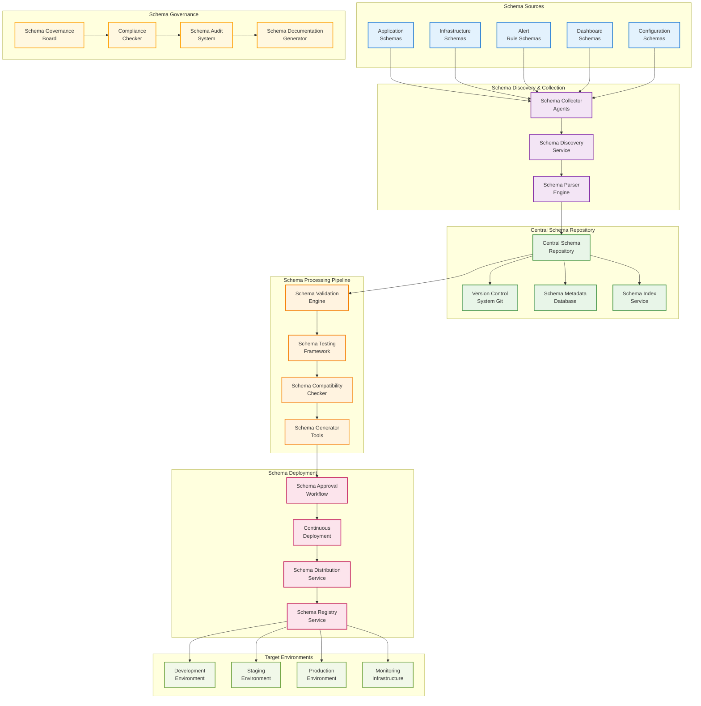
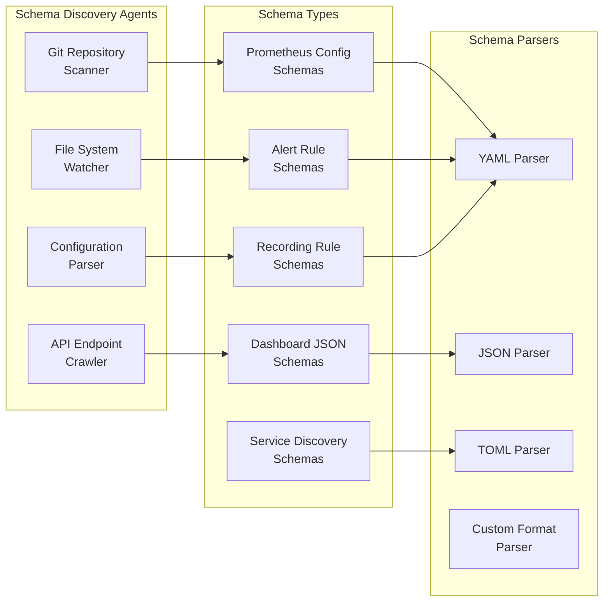
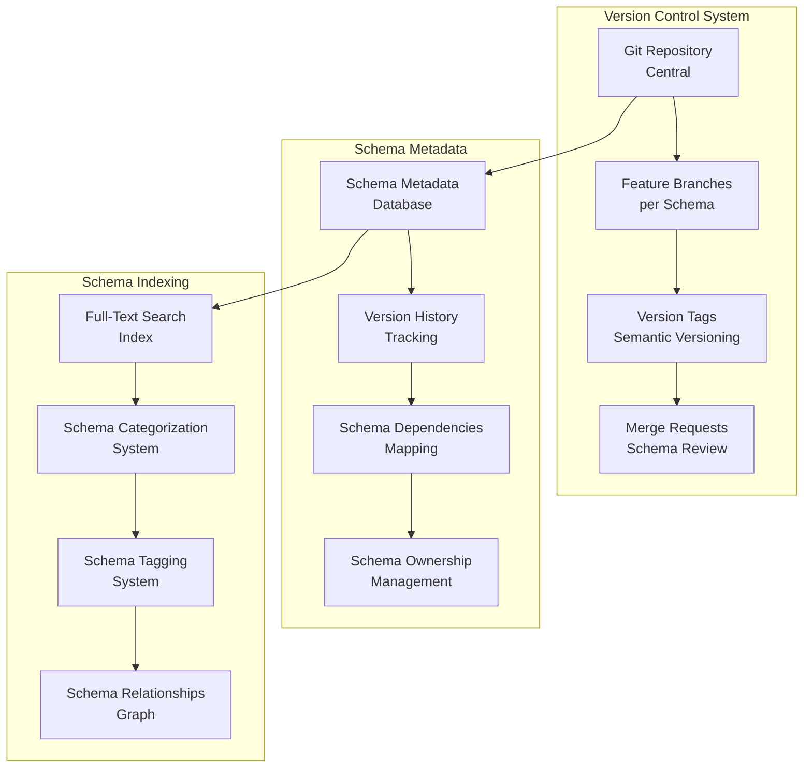
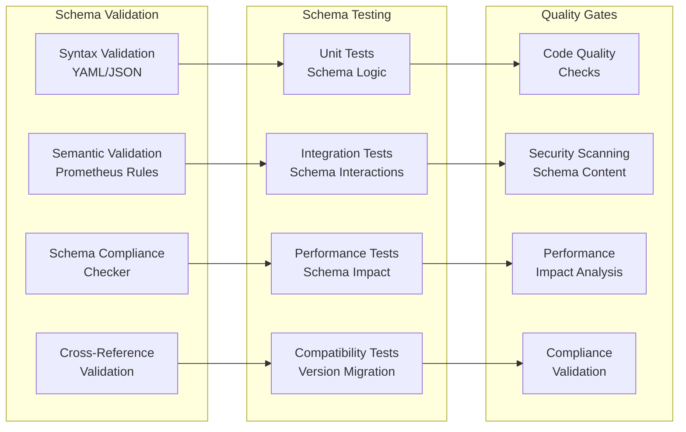
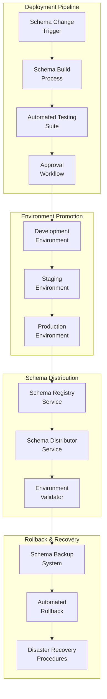
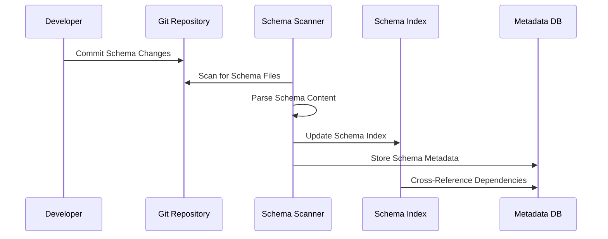
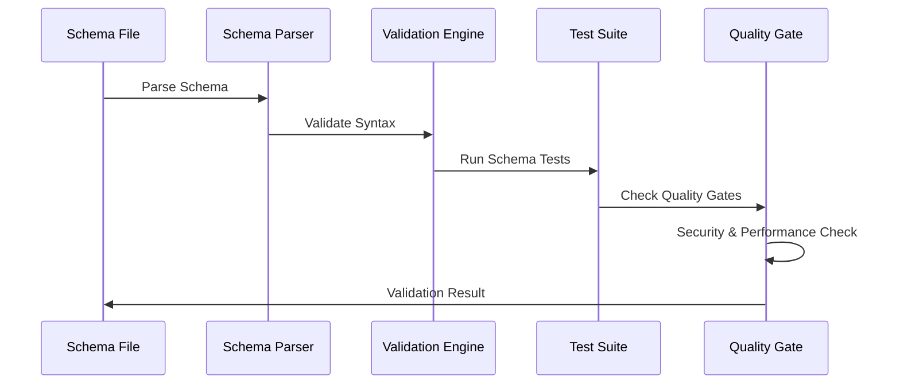
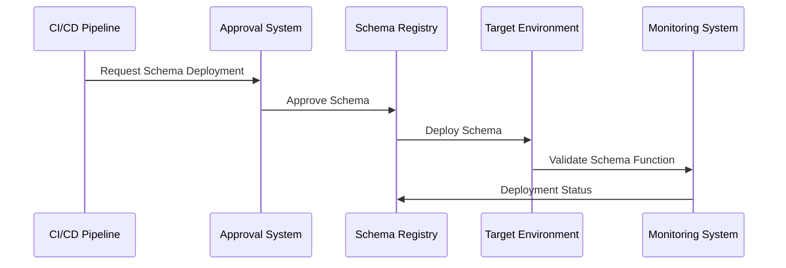
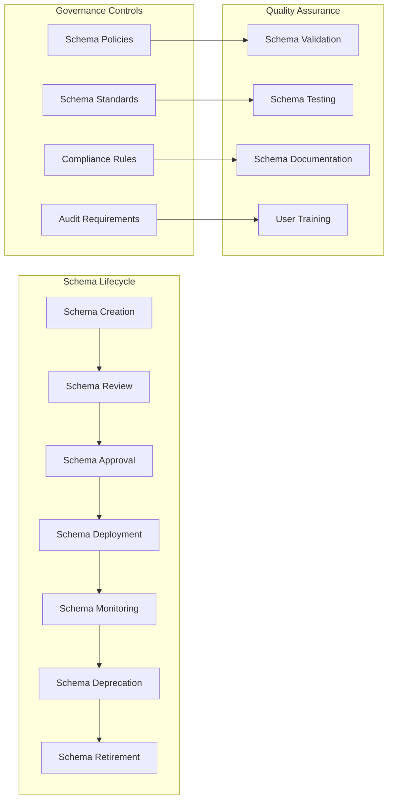

# 🗄️ **Prometheus Schema Management Architecture**

## **Schema Management System Overview**

This architecture provides comprehensive schema management for Prometheus monitoring systems, including discovery, versioning, validation, and deployment of all schemas across the organization.

## **High-Level Schema Management Architecture**



## **Detailed Schema Management Components**

### **1. Schema Discovery & Collection Layer**



### **2. Schema Versioning & Repository Management**



### **3. Schema Validation & Testing Pipeline**



### **4. Schema Deployment Architecture**



## **Schema Management Workflow**

### **Phase 1: Schema Discovery**



### **Phase 2: Schema Validation**



### **Phase 3: Schema Deployment**



## **Schema Governance Framework**

### **Schema Lifecycle Management**



## **Schema Repository Structure**

```
prometheus-schemas/
├── schemas/
│   ├── prometheus/
│   │   ├── config/
│   │   │   ├── prometheus.yml
│   │   │   ├── rules/
│   │   │   │   ├── alert_rules.yml
│   │   │   │   └── recording_rules.yml
│   │   │   └── service_discovery/
│   │   │       ├── kubernetes.yml
│   │   │       ├── consul.yml
│   │   │       └── static.yml
│   │   └── dashboards/
│   │       ├── system/
│   │       ├── application/
│   │       └── infrastructure/
│   ├── alertmanager/
│   │   ├── config/
│   │   │   └── alertmanager.yml
│   │   └── templates/
│   │       ├── email.tmpl
│   │       └── slack.tmpl
│   └── exporters/
│       ├── node_exporter/
│       ├── application_exporters/
│       └── custom_exporters/
├── schemas/
│   ├── metadata/
│   │   ├── schema_registry.json
│   │   ├── dependencies.json
│   │   └── ownership.json
│   └── versions/
│       ├── v1.0.0/
│       ├── v1.1.0/
│       └── v2.0.0/
├── tests/
│   ├── unit/
│   ├── integration/
│   └── performance/
├── docs/
│   ├── schema_documentation/
│   ├── deployment_guides/
│   └── governance_policies/
└── tools/
    ├── schema_validator/
    ├── schema_generator/
    └── schema_migrator/
```

## **Key Schema Management Features**

### **1. Automated Schema Discovery**
- **Git Repository Scanning**: Automatically discover schema files in repositories
- **File System Monitoring**: Real-time detection of schema changes
- **API Endpoint Crawling**: Discover schemas from service registries
- **Configuration Parsing**: Extract schemas from various configuration formats

### **2. Comprehensive Versioning**
- **Semantic Versioning**: Follow semantic versioning for schema releases
- **Branch Management**: Feature branches for schema development
- **Merge Request Workflow**: Code review process for schema changes
- **Tag Management**: Release tagging and changelog generation

### **3. Advanced Validation**
- **Syntax Validation**: YAML/JSON syntax checking
- **Semantic Validation**: Prometheus rule validation
- **Cross-Reference Validation**: Dependency checking
- **Compliance Validation**: Policy and standard compliance

### **4. Automated Testing**
- **Unit Testing**: Individual schema component testing
- **Integration Testing**: Schema interaction testing
- **Performance Testing**: Schema impact on system performance
- **Compatibility Testing**: Version migration testing

### **5. Deployment Automation**
- **Environment Promotion**: Automated deployment across environments
- **Rollback Capabilities**: Quick rollback to previous schema versions
- **Blue-Green Deployment**: Zero-downtime schema deployments
- **Canary Releases**: Gradual schema rollout

### **6. Governance & Compliance**
- **Schema Policies**: Enforce organizational schema standards
- **Approval Workflows**: Multi-level approval for schema changes
- **Audit Logging**: Complete audit trail of schema changes
- **Compliance Reporting**: Automated compliance reporting

### **7. Documentation & Training**
- **Auto-Generated Documentation**: Automatic schema documentation
- **Schema Catalog**: Searchable schema repository
- **Change Notifications**: Automated change notifications
- **Training Materials**: Schema usage and best practices

## **Implementation Recommendations**

### **Phase 1: Foundation (Months 1-2)**
1. Set up central schema repository
2. Implement basic schema discovery
3. Create schema validation framework
4. Establish version control processes

### **Phase 2: Automation (Months 3-4)**
1. Implement automated testing pipeline
2. Create deployment automation
3. Set up monitoring and alerting
4. Develop governance framework

### **Phase 3: Advanced Features (Months 5-6)**
1. Implement advanced validation rules
2. Create schema migration tools
3. Develop compliance reporting
4. Build user training programs

### **Phase 4: Optimization (Months 7-8)**
1. Performance optimization
2. Advanced analytics and reporting
3. Integration with existing tools
4. Continuous improvement processes

This comprehensive schema management architecture ensures that all Prometheus schemas are properly discovered, versioned, validated, and deployed across the organization while maintaining high quality, compliance, and governance standards.
