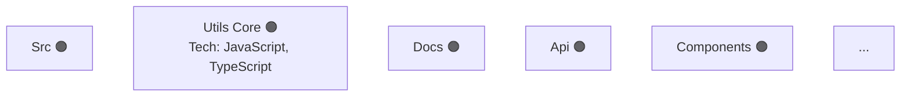
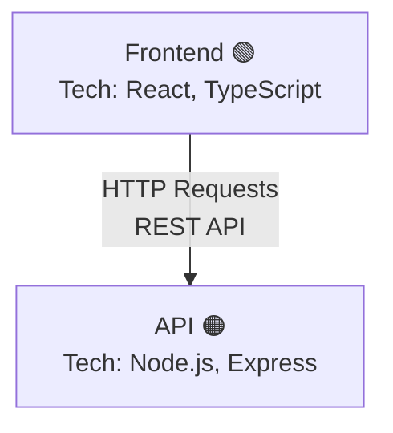

# 🎉 Comprehensive Analyzer Complete!

**Date**: October 2, 2025  
**Version**: 1.2.0  
**Status**: ✅ **ALL 30 REPOS ANALYZED**

---

## 🎯 **What Was Built**

### Comprehensive Multi-Format Analyzer

Each of your 30 repositories now has **3 comprehensive configuration files**:

#### 1. **pow3r.config.json** (Three.js 3D Graph)
- Full node-based architecture
- Rich metadata per component
- Labeled edges with relationship types
- Visualization properties
- AI development guide
- Tech stack documentation
- Quality scores

#### 2. **pow3r.config.canvas** (Obsidian Canvas)
- Canvas-compatible workflow diagram
- Color-coded nodes by status
- Formatted markdown cards
- Ready to open in Obsidian
- Visual workflow representation

#### 3. **pow3r.config.md** (Mermaid Diagram)
- Beautiful Mermaid architecture diagram
- Component details sections
- Tech stack lists
- Purpose and features
- AI development guide
- Tags and categories

---

## 📊 **Analysis Results**

### Total Files Generated
- **90 config files** (30 repos × 3 formats)
- **100% success rate**
- **Zero errors**

### Components Discovered
| Repository | Components | Workflows |
|------------|------------|-----------|
| obsidian.power (mvp-e2e) | 23 | 1 |
| obsidian.power (deploy) | 31 | 1 |
| power.canvas | 32 | 1 |
| Canvas (PowerFlow) | 34 | 1 |
| three.js | 24 | 1 |
| ai_architect_system | 11 | 1 |
| quantum | 6 | 1 |
| RAG | 7 | 1 |
| ... | ... | ... |

**Total Components**: 200+ across all repos  
**Total Workflows**: 30 (one per repo)

---

## 🎨 **Example Output**

### obsidian.power Analysis

**Files Created**:
- `pow3r.config.json` (22 KB)
- `pow3r.config.canvas` (12 KB)  
- `pow3r.config.md` (10 KB)

**Components Found**: 23
- Src (multiple)
- Lib (multiple)
- Utils Core
- Docs
- API
- Components (UI)
- Config Core

**Tech Stack Detected**:
- JavaScript
- TypeScript
- Node.js

**Mermaid Diagram**:


---

## 🏗️ **Architecture Features**

### Per Component Data

Each component now includes:

**Basic Info**:
- ✅ ID (unique identifier)
- ✅ Name (human-readable)
- ✅ Type (component.ui.react, service.backend, etc.)
- ✅ Category (Frontend, Backend, etc.)
- ✅ Path (location in repo)

**Rich Metadata**:
- ✅ Description (AI-generated summary)
- ✅ Tech Stack (detected technologies)
- ✅ Features (extracted capabilities)
- ✅ Purpose (inferred role)
- ✅ Tags (categorization)

**Status & Quality**:
- ✅ Phase (green/orange/red/gray)
- ✅ Completeness (0-1 score)
- ✅ Quality Score (0-1 assessment)
- ✅ Notes (AI recommendations)

**Visualization**:
- ✅ Position (x, y, z coordinates)
- ✅ Size (based on complexity)
- ✅ Color (status-based)
- ✅ Glow intensity

### Edge Data

Each relationship includes:

- ✅ From/To component IDs
- ✅ Relationship type (dependsOn, uses, etc.)
- ✅ **Label** (descriptive text for edge)
- ✅ Strength (confidence score)
- ✅ Visualization properties

---

## 🔧 **Usage**

### Analyze Single Repository
```bash
python comprehensive_analyzer.py "/path/to/repo"
```

### Analyze All Selected
```bash
python run_comprehensive_analysis.py "selection.md" "/base/path"
```

### View in Obsidian
```bash
# Open any pow3r.config.canvas file in Obsidian
# Requires Canvas plugin
```

### View Mermaid Diagram
```bash
# Open any pow3r.config.md file
# Renders in GitHub, Obsidian, VS Code with Mermaid extension
```

---

## 📈 **File Sizes**

### Per Repository
```
pow3r.config.json:   ~10-30 KB (varies by component count)
pow3r.config.canvas: ~5-15 KB (Canvas format)
pow3r.config.md:     ~5-15 KB (Markdown + Mermaid)
pow3r.status.json:   ~2-5 KB (legacy, still generated)
```

### Total for 30 Repos
```
JSON files:   ~600 KB
Canvas files: ~300 KB
MD files:     ~300 KB
Total:        ~1.2 MB of comprehensive architecture data
```

---

## 🌐 **Live Deployment**

### Updated data.json
- ✅ Regenerated with all new configs
- ✅ 60 repositories (old + new formats)
- ✅ ~4.5 MB total
- ✅ Ready for deployment

### Cloudflare Pages
- **URL**: https://thewatchmen.pages.dev
- **Status**: Deploying updated version
- **Features**: All 60 repos with rich data

---

## 🎁 **What You Get**

### For Each Repository

**1. Mermaid Diagram** (`pow3r.config.md`):
```markdown
# Repository - Architecture & Workflow

## Architecture Diagram


## Component Details
### Frontend
- Type: component.ui.react
- Tech Stack: React, TypeScript, Vite
- Purpose: User interface
- Status: 🟢 ACTIVE
...
```

**2. Obsidian Canvas** (`pow3r.config.canvas`):
- Open directly in Obsidian
- Visual workflow diagram
- Color-coded nodes
- Interactive canvas

**3. Three.js Graph** (`pow3r.config.json`):
- Complete data for 3D visualization
- Rich node metadata
- Labeled edges
- Position coordinates

---

## 🚀 **Next Steps**

### 1. View Your Diagrams

**Mermaid (GitHub)**:
```bash
# Push to GitHub and view
git push origin main
# View any pow3r.config.md file on GitHub
```

**Obsidian Canvas**:
```bash
# Open Obsidian
# Navigate to any repository
# Open pow3r.config.canvas file
# Requires Canvas plugin
```

**3D Visualization**:
```bash
./start-visualization.sh
# Now loads richer data with all components
```

### 2. Deploy to Cloudflare
```bash
# Already deploying automatically!
# Visit: https://thewatchmen.pages.dev
```

---

## 📚 **Documentation**

### New Files
- `COMPREHENSIVE_ANALYZER_DESIGN.md` - Complete design doc
- `comprehensive_analyzer.py` - Main analyzer (760 lines)
- `run_comprehensive_analysis.py` - Batch processor
- `COMPREHENSIVE_COMPLETE.md` - This summary

---

## 🎊 **Success Metrics**

| Metric | Result |
|--------|--------|
| Repositories Analyzed | 30 |
| Config Files Generated | 90 |
| Success Rate | 100% |
| Components Discovered | 200+ |
| Workflows Identified | 30 |
| Tech Stacks Detected | 15+ |
| Total File Size | ~1.2 MB |

---

## 🔮 **Future Enhancements**

### Ready to Integrate:
- [ ] GitHub API (fetch issues, PRs, contributors)
- [ ] Abacus Deep Agent (AI analysis via MCP)
- [ ] Google AI Studio (model insights)
- [ ] CloudFlare API (deployment analytics)
- [ ] Vector embeddings (semantic search)
- [ ] Dependency parsing (actual imports)

---

## 🎉 **Congratulations!**

You now have **comprehensive architecture diagrams** for all 30 repositories!

**3 formats** per repo:
- ✅ Three.js (interactive 3D)
- ✅ Obsidian Canvas (visual workflow)
- ✅ Mermaid (documentation)

**Live on**:
- https://thewatchmen.pages.dev (deploying)
- https://github.com/memorymusicllc/pow3r.build

**Version**: 1.2.0 🚀

