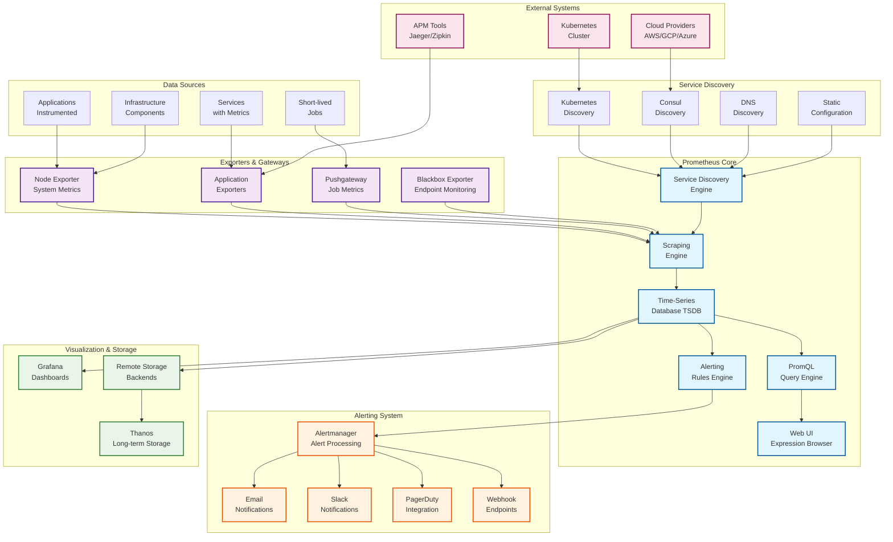
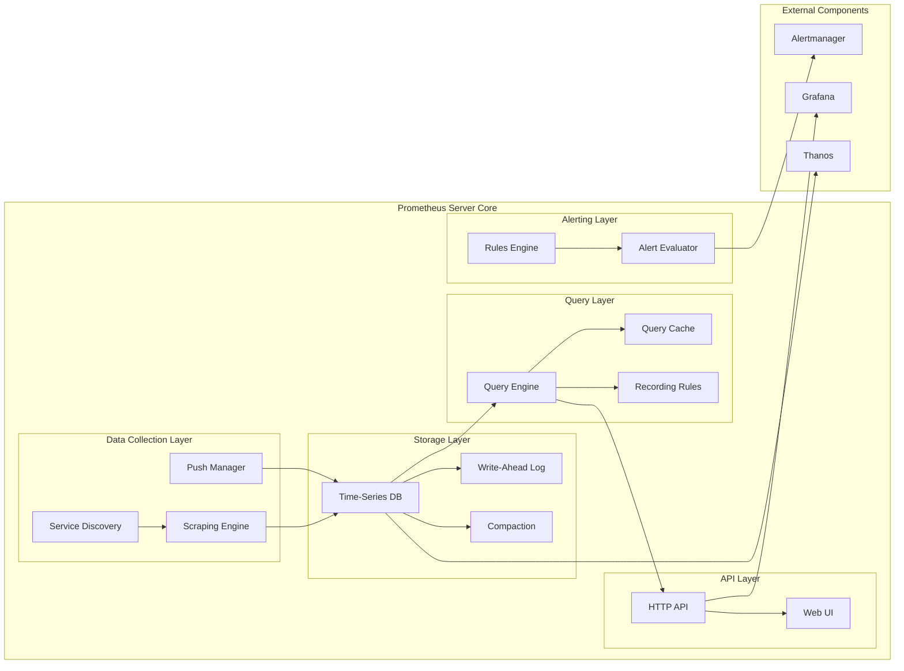
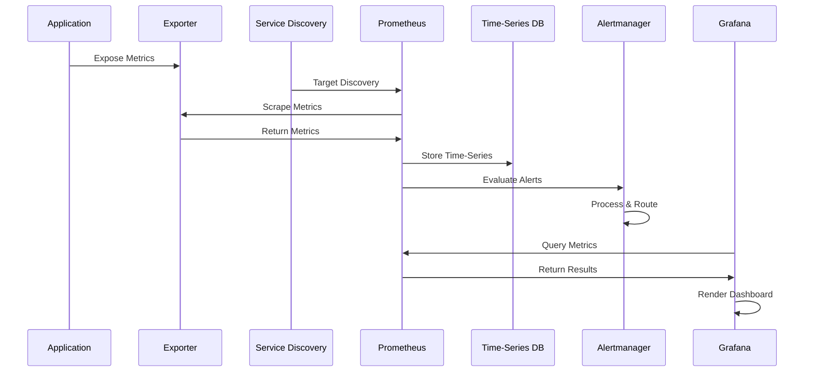
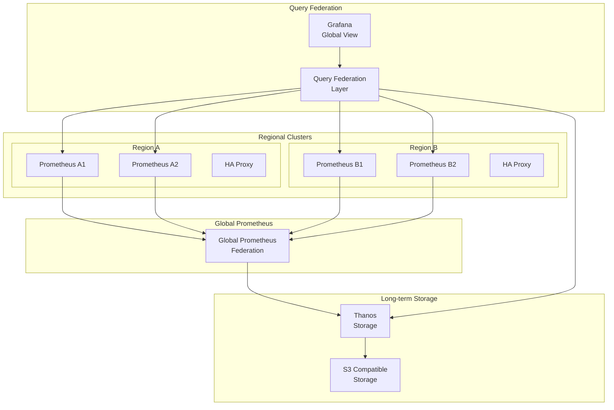
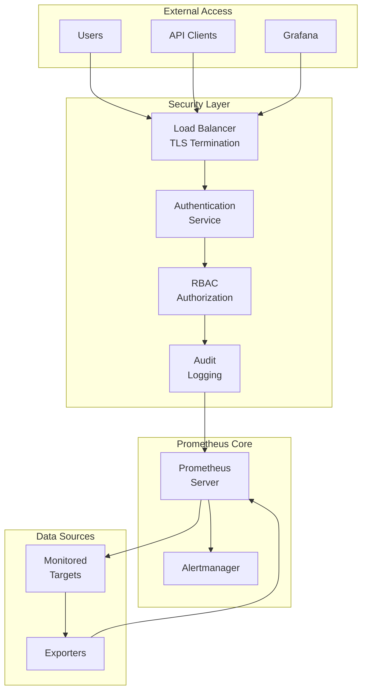

# 🏛️ **Prometheus Architecture Diagram**

## **High-Level System Architecture**

## **Detailed Component Architecture**

## **Data Flow Architecture**

## **Scalability Architecture**

## **Security Architecture**

## **Key Architectural Principles**

### **1. Pull-Based Architecture**
- Prometheus actively scrapes metrics from targets
- Reduces complexity and improves reliability
- Natural load balancing and failure handling

### **2. Multi-Dimensional Data Model**
- Metrics identified by name + labels
- Enables powerful querying and filtering
- Supports high cardinality data

### **3. Time-Series Optimized Storage**
- Custom TSDB for time-series data
- Efficient compression and retention
- Fast query performance

### **4. Service Discovery Integration**
- Dynamic target discovery
- Cloud-native architecture support
- Automatic scaling and configuration

### **5. Federation and Scalability**
- Hierarchical federation support
- Global and regional querying
- Long-term storage integration

### **6. Alerting and Notification**
- Sophisticated alerting rules
- Alertmanager for advanced routing
- Multiple notification channels

### **7. Extensibility**
- Rich exporter ecosystem
- Custom instrumentation
- Integration with existing monitoring tools
