# 🎯 **Prometheus Implementation Status & AI Agent Management**

## **Current Implementation Analysis**

Based on the existing codebase analysis, here's the current state of Prometheus implementation:

### **Current Status Assessment**
- **Core Prometheus Server**: 0% (Not implemented)
- **Schema Management**: 0% (Not implemented) 
- **Monitoring Infrastructure**: 0% (Not implemented)
- **Visualization Components**: 0% (Not implemented)
- **Deployment Pipeline**: 0% (Not implemented)

---

## **Enhanced Architecture with Completion Status**

### **High-Level System Architecture with Status**

```mermaid
graph TB
    subgraph "Data Sources"
        A1[Applications<br/>Instrumented<br/>🔴 0%]
        A2[Services<br/>with Metrics<br/>🔴 0%]
        A3[Infrastructure<br/>Components<br/>🔴 0%]
        A4[Short-lived<br/>Jobs<br/>🔴 0%]
    end

    subgraph "Exporters & Gateways"
        E1[Node Exporter<br/>System Metrics<br/>🔴 0%]
        E2[Application<br/>Exporters<br/>🔴 0%]
        E3[Pushgateway<br/>Job Metrics<br/>🔴 0%]
        E4[Blackbox Exporter<br/>Endpoint Monitoring<br/>🔴 0%]
    end

    subgraph "Service Discovery"
        SD1[Kubernetes<br/>Discovery<br/>🔴 0%]
        SD2[Consul<br/>Discovery<br/>🔴 0%]
        SD3[DNS<br/>Discovery<br/>🔴 0%]
        SD4[Static<br/>Configuration<br/>🔴 0%]
    end

    subgraph "Prometheus Core"
        P1[Service Discovery<br/>Engine<br/>🔴 0%]
        P2[Scraping<br/>Engine<br/>🔴 0%]
        P3[Time-Series<br/>Database TSDB<br/>🔴 0%]
        P4[PromQL<br/>Query Engine<br/>🔴 0%]
        P5[Alerting<br/>Rules Engine<br/>🔴 0%]
        P6[Web UI<br/>Expression Browser<br/>🔴 0%]
    end

    subgraph "Alerting System"
        AM[Alertmanager<br/>Alert Processing<br/>🔴 0%]
        NC1[Email<br/>Notifications<br/>🔴 0%]
        NC2[Slack<br/>Notifications<br/>🔴 0%]
        NC3[PagerDuty<br/>Integration<br/>🔴 0%]
        NC4[Webhook<br/>Endpoints<br/>🔴 0%]
    end

    subgraph "Visualization & Storage"
        G[Grafana<br/>Dashboards<br/>🔴 0%]
        RS[Remote Storage<br/>Backends<br/>🔴 0%]
        T[Thanos<br/>Long-term Storage<br/>🔴 0%]
    end

    subgraph "External Systems"
        K8S[Kubernetes<br/>Cluster<br/>🔴 0%]
        CLOUD[Cloud Providers<br/>AWS/GCP/Azure<br/>🔴 0%]
        APM[APM Tools<br/>Jaeger/Zipkin<br/>🔴 0%]
    end

    %% Data Flow with Status
    A1 -->|🔴 0%| E1
    A2 -->|🔴 0%| E2
    A3 -->|🔴 0%| E1
    A4 -->|🔴 0%| E3

    E1 -->|🔴 0%| P2
    E2 -->|🔴 0%| P2
    E3 -->|🔴 0%| P2
    E4 -->|🔴 0%| P2

    SD1 -->|🔴 0%| P1
    SD2 -->|🔴 0%| P1
    SD3 -->|🔴 0%| P1
    SD4 -->|🔴 0%| P1

    P1 -->|🔴 0%| P2
    P2 -->|🔴 0%| P3
    P3 -->|🔴 0%| P4
    P3 -->|🔴 0%| P5
    P4 -->|🔴 0%| P6
    P5 -->|🔴 0%| AM

    AM -->|🔴 0%| NC1
    AM -->|🔴 0%| NC2
    AM -->|🔴 0%| NC3
    AM -->|🔴 0%| NC4

    P3 -->|🔴 0%| G
    P3 -->|🔴 0%| RS
    RS -->|🔴 0%| T

    K8S -->|🔴 0%| SD1
    CLOUD -->|🔴 0%| SD2
    APM -->|🔴 0%| E2

    %% Status-based Styling
    classDef red fill:#ffebee,stroke:#d32f2f,stroke-width:3px
    classDef orange fill:#fff3e0,stroke:#f57c00,stroke-width:2px
    classDef green fill:#e8f5e8,stroke:#2e7d32,stroke-width:2px

    class A1,A2,A3,A4,E1,E2,E3,E4,SD1,SD2,SD3,SD4,P1,P2,P3,P4,P5,P6,AM,NC1,NC2,NC3,NC4,G,RS,T,K8S,CLOUD,APM red
```

### **Schema Management Architecture with Status**

```mermaid
graph TB
    subgraph "Schema Sources"
        A1[Application<br/>Schemas<br/>🔴 0%]
        A2[Infrastructure<br/>Schemas<br/>🔴 0%]
        A3[Alert<br/>Rule Schemas<br/>🔴 0%]
        A4[Dashboard<br/>Schemas<br/>🔴 0%]
        A5[Configuration<br/>Schemas<br/>🔴 0%]
    end

    subgraph "Schema Discovery & Collection"
        SD[Schema Discovery<br/>Service<br/>🔴 0%]
        SC[Schema Collector<br/>Agents<br/>🔴 0%]
        SP[Schema Parser<br/>Engine<br/>🔴 0%]
    end

    subgraph "Central Schema Repository"
        CSR[Central Schema<br/>Repository<br/>🔴 0%]
        VCS[Version Control<br/>System Git<br/>🔴 0%]
        SM[Schema Metadata<br/>Database<br/>🔴 0%]
        SI[Schema Index<br/>Service<br/>🔴 0%]
    end

    subgraph "Schema Processing Pipeline"
        SV[Schema Validation<br/>Engine<br/>🔴 0%]
        ST[Schema Testing<br/>Framework<br/>🔴 0%]
        SC2[Schema Compatibility<br/>Checker<br/>🔴 0%]
        SG[Schema Generator<br/>Tools<br/>🔴 0%]
    end

    subgraph "Schema Deployment"
        CD[Continuous<br/>Deployment<br/>🔴 0%]
        SA[Schema Approval<br/>Workflow<br/>🔴 0%]
        SD2[Schema Distribution<br/>Service<br/>🔴 0%]
        SR[Schema Registry<br/>Service<br/>🔴 0%]
    end

    subgraph "Target Environments"
        DEV[Development<br/>Environment<br/>🔴 0%]
        STAGING[Staging<br/>Environment<br/>🔴 0%]
        PROD[Production<br/>Environment<br/>🔴 0%]
        MONITOR[Monitoring<br/>Infrastructure<br/>🔴 0%]
    end

    subgraph "Schema Governance"
        SG2[Schema Governance<br/>Board<br/>🔴 0%]
        COMP[Compliance<br/>Checker<br/>🔴 0%]
        AUDIT[Schema Audit<br/>System<br/>🔴 0%]
        DOC[Schema Documentation<br/>Generator<br/>🔴 0%]
    end

    %% Data Flow with Status
    A1 -->|🔴 0%| SC
    A2 -->|🔴 0%| SC
    A3 -->|🔴 0%| SC
    A4 -->|🔴 0%| SC
    A5 -->|🔴 0%| SC

    SC -->|🔴 0%| SD
    SD -->|🔴 0%| SP
    SP -->|🔴 0%| CSR

    CSR -->|🔴 0%| VCS
    CSR -->|🔴 0%| SM
    CSR -->|🔴 0%| SI

    CSR -->|🔴 0%| SV
    SV -->|🔴 0%| ST
    ST -->|🔴 0%| SC2
    SC2 -->|🔴 0%| SG

    SG -->|🔴 0%| SA
    SA -->|🔴 0%| CD
    CD -->|🔴 0%| SD2
    SD2 -->|🔴 0%| SR

    SR -->|🔴 0%| DEV
    SR -->|🔴 0%| STAGING
    SR -->|🔴 0%| PROD
    SR -->|🔴 0%| MONITOR

    SG2 -->|🔴 0%| COMP
    COMP -->|🔴 0%| AUDIT
    AUDIT -->|🔴 0%| DOC

    %% Status-based Styling
    classDef red fill:#ffebee,stroke:#d32f2f,stroke-width:3px
    classDef orange fill:#fff3e0,stroke:#f57c00,stroke-width:2px
    classDef green fill:#e8f5e8,stroke:#2e7d32,stroke-width:2px

    class A1,A2,A3,A4,A5,SD,SC,SP,CSR,VCS,SM,SI,SV,ST,SC2,SG,CD,SA,SD2,SR,DEV,STAGING,PROD,MONITOR,SG2,COMP,AUDIT,DOC red
```

---

## **AI Agent Management Plan**

### **Agent Assignment Strategy**

```mermaid
graph TB
    subgraph "AI Agent Team Structure"
        AGENT1[Agent 1: Core Infrastructure<br/>🎯 Prometheus Server & TSDB]
        AGENT2[Agent 2: Data Collection<br/>🎯 Exporters & Service Discovery]
        AGENT3[Agent 3: Alerting & Visualization<br/>🎯 Alertmanager & Grafana]
        AGENT4[Agent 4: Schema Management<br/>🎯 Schema Discovery & Versioning]
        AGENT5[Agent 5: Deployment & Operations<br/>🎯 CI/CD & Monitoring]
    end

    subgraph "Progress Tracking"
        PT[Progress Tracker<br/>📊 Real-time Status]
        DASH[Management Dashboard<br/>📈 Completion Metrics]
        ALERTS[Completion Alerts<br/>🚨 Blockers & Issues]
    end

    subgraph "Coordination"
        COORD[Agent Coordinator<br/>🤝 Cross-Agent Communication]
        REVIEW[Code Review<br/>✅ Quality Assurance]
        MERGE[Merge Management<br/>🔄 Integration Control]
    end

    AGENT1 --> PT
    AGENT2 --> PT
    AGENT3 --> PT
    AGENT4 --> PT
    AGENT5 --> PT

    PT --> DASH
    DASH --> ALERTS

    AGENT1 --> COORD
    AGENT2 --> COORD
    AGENT3 --> COORD
    AGENT4 --> COORD
    AGENT5 --> COORD

    COORD --> REVIEW
    REVIEW --> MERGE
```

### **Detailed Agent Responsibilities**

#### **🤖 Agent 1: Core Infrastructure (Prometheus Server & TSDB)**
**Target: 100% Core Prometheus Functionality**

**Phase 1 (Weeks 1-2): Foundation**
- [ ] Set up Prometheus server configuration
- [ ] Implement basic TSDB storage
- [ ] Create service discovery engine
- [ ] Build scraping engine
- [ ] Implement PromQL query engine

**Phase 2 (Weeks 3-4): Advanced Features**
- [ ] Add recording rules support
- [ ] Implement query caching
- [ ] Build web UI expression browser
- [ ] Add federation support
- [ ] Implement remote read/write

**Deliverables:**
- Complete Prometheus server implementation
- TSDB with compression and retention
- Full PromQL query language support
- Web UI with expression browser
- Federation and remote storage integration

#### **🤖 Agent 2: Data Collection (Exporters & Service Discovery)**
**Target: 100% Data Collection Infrastructure**

**Phase 1 (Weeks 1-2): Core Exporters**
- [ ] Implement Node Exporter for system metrics
- [ ] Create application exporters framework
- [ ] Build Pushgateway for short-lived jobs
- [ ] Implement Blackbox Exporter for endpoint monitoring

**Phase 2 (Weeks 3-4): Service Discovery**
- [ ] Kubernetes service discovery
- [ ] Consul service discovery
- [ ] DNS-based discovery
- [ ] Static configuration support
- [ ] Cloud provider discovery (AWS, GCP, Azure)

**Deliverables:**
- Complete exporter ecosystem
- All major service discovery mechanisms
- Custom exporter development framework
- Documentation and examples

#### **🤖 Agent 3: Alerting & Visualization (Alertmanager & Grafana)**
**Target: 100% Alerting and Visualization**

**Phase 1 (Weeks 1-2): Alerting System**
- [ ] Implement Alertmanager
- [ ] Create alert rules engine
- [ ] Build notification channels (Email, Slack, PagerDuty)
- [ ] Implement alert grouping and routing
- [ ] Add silence management

**Phase 2 (Weeks 3-4): Visualization**
- [ ] Integrate Grafana
- [ ] Create dashboard templates
- [ ] Implement recording rules
- [ ] Build custom visualization components
- [ ] Add dashboard sharing and versioning

**Deliverables:**
- Complete alerting system
- Grafana integration with dashboards
- Notification system with multiple channels
- Dashboard templates and sharing

#### **🤖 Agent 4: Schema Management (Schema Discovery & Versioning)**
**Target: 100% Schema Management System**

**Phase 1 (Weeks 1-2): Schema Discovery**
- [ ] Build schema discovery service
- [ ] Create schema collector agents
- [ ] Implement schema parser engine
- [ ] Set up central schema repository
- [ ] Add version control integration

**Phase 2 (Weeks 3-4): Schema Processing**
- [ ] Create schema validation engine
- [ ] Build schema testing framework
- [ ] Implement compatibility checker
- [ ] Add schema generator tools
- [ ] Set up governance framework

**Deliverables:**
- Complete schema management system
- Automated discovery and versioning
- Validation and testing pipeline
- Governance and compliance framework

#### **🤖 Agent 5: Deployment & Operations (CI/CD & Monitoring)**
**Target: 100% Deployment and Operations**

**Phase 1 (Weeks 1-2): Deployment Pipeline**
- [ ] Set up CI/CD pipeline
- [ ] Create deployment automation
- [ ] Implement environment promotion
- [ ] Add rollback capabilities
- [ ] Build monitoring and alerting

**Phase 2 (Weeks 3-4): Operations**
- [ ] Create operational runbooks
- [ ] Implement backup and recovery
- [ ] Add performance monitoring
- [ ] Build troubleshooting tools
- [ ] Create maintenance procedures

**Deliverables:**
- Complete deployment pipeline
- Operational procedures and tools
- Monitoring and alerting for the system
- Documentation and runbooks

---

## **Progress Tracking System**

### **Real-time Status Dashboard**

### **Weekly Progress Milestones**

#### **Week 1 Targets**
- **Agent 1**: Basic Prometheus server setup (25%)
- **Agent 2**: Node Exporter implementation (25%)
- **Agent 3**: Basic Alertmanager setup (25%)
- **Agent 4**: Schema discovery framework (25%)
- **Agent 5**: CI/CD pipeline foundation (25%)

#### **Week 2 Targets**
- **Agent 1**: TSDB and query engine (50%)
- **Agent 2**: Service discovery mechanisms (50%)
- **Agent 3**: Notification channels (50%)
- **Agent 4**: Schema validation engine (50%)
- **Agent 5**: Deployment automation (50%)

#### **Week 3 Targets**
- **Agent 1**: Advanced features and federation (75%)
- **Agent 2**: Cloud provider discovery (75%)
- **Agent 3**: Grafana integration (75%)
- **Agent 4**: Schema processing pipeline (75%)
- **Agent 5**: Monitoring and alerting (75%)

#### **Week 4 Targets**
- **Agent 1**: Complete core functionality (100%)
- **Agent 2**: Complete data collection (100%)
- **Agent 3**: Complete alerting and visualization (100%)
- **Agent 4**: Complete schema management (100%)
- **Agent 5**: Complete deployment and operations (100%)

---

## **Risk Management & Mitigation**

### **High-Risk Areas**
1. **Complexity Integration**: Multiple agents working on interconnected systems
2. **Data Consistency**: Schema management across distributed components
3. **Performance**: TSDB and query engine optimization
4. **Security**: Authentication and authorization across all components
5. **Scalability**: Federation and remote storage implementation

### **Mitigation Strategies**
1. **Daily Standups**: 15-minute daily coordination meetings
2. **Integration Testing**: Continuous integration testing between agents
3. **Code Reviews**: Mandatory peer review for all changes
4. **Documentation**: Real-time documentation updates
5. **Rollback Plans**: Automated rollback for failed deployments

### **Success Metrics**
- **Code Coverage**: Minimum 80% test coverage
- **Performance**: Sub-second query response times
- **Reliability**: 99.9% uptime target
- **Security**: Zero critical vulnerabilities
- **Documentation**: 100% API documentation coverage

This comprehensive management plan ensures coordinated development across all 5 AI agents to achieve 100% completion of the Prometheus monitoring system.
